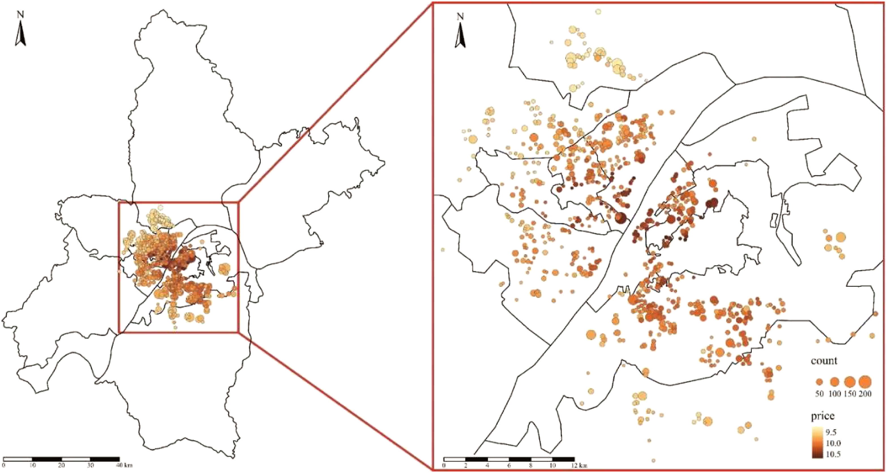

A brief tutorial to Hierarchical and Geographically Weighted Regression model and **hgwrr** package in R.

```{r, include=F}
knitr::opts_chunk$set(message = F, warning = F)
```

## Introduction to HGWR Model

### What is HGWR model?

Hierarchical and Geographically Weighted Regression, shorted for HGWR,
is a spatial modelling method designed for data of spatial hierarchical structures.
Just as its name implies, this is a combination of Hierarchical Linear Model
[HLM, also known as Multilevel Model, @Raudenbush-1993]
and Geographically Weighted Regression [GWR, @BrunsdonFotheringham-1996].
In this model, spatial effects are divided into three types: global fixed, local fixed and random.
Formally, it is expressed as
$$
y = G\gamma + X\beta + Z\mu + \epsilon
$$
with $y$ the dependent variable,
$G$ the group level independent variables, $\gamma$ the local fixed effects,
$X$ also the group level independent variables, $\beta$ the global fixed effects,
$Z$ the individual level independent variables, $\mu$ the random effects,
$\epsilon$ the individual errors.

### Why HGWR model?

As we know, hierarchical structure is commonly existing in spatial data.
For example, cities can be grouped by provinces or other higher-level administrative district they belong to;
house prices may share some factors from the block;
and students in one school have different access to education resources with those in another school.
When dealing with this type of data, we usually choose HLM to address the within-group homogeneity and the between-group heterogeneity.
And there are usually two types of variables: group-level variables and sample-level variables.
The formal ones are used to describe the properties of groups
(such as the provinces, blocks and schools);
the latter ones are observations of individual samples
(such as the cities, houses and students).
The effect of some sample-level variables are similar in all groups,
thus they are modelled with fixed coefficients (effects).
For others, they are modelled individually, i.e., with random effects.

However, for group-level variables, they can only be modelled with fixed effects.
For spatial data, we would encounter some problems.
According to the Tobler's first law of Geography "Everything is related to everything else, but near things are more related than distant things" [@Tobler-1970].
If the model is calibrated with equally weighted samples, spatial heterogeneity would be overlooked [@FotheringhamBrunsdon-2002].
Thus, it requires us to distinguish "local fixed effects" from "global fixed effects" to discover spatial heterogeneity in group-level variables.

But why not GWR or Multiscale GWR [@FotheringhamYang-2017, LuBrunsdon-2017]
Because when dealing with data of hierarchical structures, GWR is problematic [@HuLu-2022].
We know that GWR calibrate a model with unique coefficients on each sample by borrowing data from its neighbours.
And it uses a parameter "bandwidth" to control how many neighbours are included.
If samples are not hierarchically structured, everything works well.
However, just imagine a situation like Figure 1.
For the two samples of red color and blue color,
we take the same number of their neighbours,
but actually the spatial extents are not the same.
In extreme cases, spatial extends of some samples could be too small to hold more than one or two location, but some are large enough.
This would lead to the failure of bandwidth optimization and reduce the reliability of the optimized bandwidth.

<video autoplay muted controls>
  <source src="assets/multisampling.mp4" type="video/mp4">
</video>

> As shown in this video, bandwidths have inequal spatial scale for two samples (represented by cubes).
> Both the samples represented by large red cubes and large blue cubes take 41 neighbour samples to calibrate GWR models. 
> For the red one, neighbours on 8 nearest locations are taken. 
> But the figure for the blue one is only 6.
> This situation means estimated coefficients are more smoothed for the red samples.
> In other words, estimations for the blue samples are much local.

To solve the problems mentioned above, we need to use HGWR model.
It is able to modelling spatial hierarchical structure and spatial heterogeneity simultaneously.
Examples below can show that it works well for spatial hierarchical data.

## Modelling with HGWR Model

The R package **hgwrr** is built for calibrating HGWR model.
In this section, we are going to show how to use it.

### Installation

Package **hgwrr** is available on [CRAN](https://cran.r-project.org/package=hgwrr).
Simply type the following codes to install it.

```r
install.packages("hgwrr")
```

Or download [latest released source package](https://github.com/HPDell/hlmgwr-backfitting-ml/releases/latest)
and run the following command to install this package.

```bash
R CMD INSTALL hgwrr_0.2-0.tar.gz
```

Note that [RTools](https://cran.r-project.org/bin/windows/Rtools/) is required on Windows.

### Usage

We are going to show the usage of **hgwrr** package with a simulated data.

First, we need to load this package in an R session.

```{r, error=F}
library(hgwrr)
```

Then we can calibrate an HGWR model via `hgwr()` function.

```r
hgwr(
  formula, data, local.fixed, coords, bw,
  alpha = 0.01, eps_iter = 1e-06, eps_gradient = 1e-06, max_iters = 1e+06,
  max_retries = 10, ml_type = HGWR_ML_TYPE_D_ONLY, verbose = 0
)
```

The first five arguments are mandatory.

- `formula` accepts a formula object in R. Its format follows **lme4** package.
  As there are two types of effects: fixed effects and random effects,
  we use the following format to specify both of them:

    ```r
    dependent ~ fixed1 + fixed2 + (random1 + random2 | group)
    ```

- `data` accepts a DataFrame object in R.
  All variables specified in `formula` are extracted from `data`.
  In this stage, `Spatial*DataFrame` is not supported.
- `local.fixed` accepts a list of character specifying which fixed effects are local.
  For example, if `fixed1` needs to be local fixed, then set `local.fixed` to `c("fixed1")`.
- `coords` accepts a matrix of 2 columns. Each row is the longitude and latitude of each group.
- `bw` accepts a integer or numeric number to specify the bandwidth used in geographically weighted process.
  Currently it can only be adaptive bandwidth.

Other arguments are optional which is used to control the backfitting maximum likelihood algorithm.
On most occassions the default values are fine.
If the default values cause some problems and you want change some of them,
please check the documentation of function `hgwr()` for more infomation.

### Example: A Small Simulated Data Set

*This example is used to show the usage of this package and to test whether it works.
We don't care about how good the fitness of this model is with this data set.*

A data set "multisampling" is provided with this package,

```{r}
data(multisampling)
head(multisampling$data)
head(multisampling$coord)
```

where `y` is the dependent variable,
`g1` and `g2` are two group-level variables,
`z1` and `x1` are two sample-level variables,
`group` are the labels of the groups they belong to,
and `U`, `V` are longitude and latitude coordinate values of all groups.

We regards `g1` and `g2` have local fixed effects, `x1` have global fixed effects and `z1` have random effects.
Then we can calibrate an HGWR model with like this

```{r, cache=T}
model1 <- hgwr(
  formula = y ~ g1 + g2 + x1 + (z1 | group),
  data = multisampling$data,
  local.fixed = c("g1", "g2"),
  coords = multisampling$coord,
  bw = 10
)
model1
```

The output of the model shows estimations of global fixed effects,
summary of those of local fixed effects.
Also there are the standard deviations of random effects and correlation coefficients between them.

Then we can have a look on the coefficient estimations.

```{r}
coef(model1)
```

With **ggplot2** or other packages, we can create some figures.

```{r}
library(ggplot2)
model1_coef_coord <- as.data.frame(cbind(multisampling$coord, coef(model1)))
ggplot(model1_coef_coord, aes(x = U, y = V)) +
  geom_point(aes(color = g1)) +
  theme_bw()
```

We can also convert it to spatial data and use **tmap** to visualize.

```{r}
library(sf)
library(tmap)
model1_coef_coord_sf <- st_as_sf(model1_coef_coord,
                                 coords = names(multisampling$coord),
                                 crs = 27700)
tm_shape(model1_coef_coord_sf) + tm_dots(col = c("g1", "g2"), size = 0.5)
```

And we can also fetch the fitted and residuals.

```{r}
head(data.frame(
  real = multisampling$data$y,
  fitted = fitted(model1),
  residuals = residuals(model1)
))
```

The `summary()` function will give some statistical information about this model.

```{r}
summary(model1)
```

On the current stage, only pesudo $R^2$ is available.
In the future, more diagnostic information will be provided in this package.

### Example: Large Scale Simulated Data

In the former example, there are only `r nrow(multisampling$data)` observations and `r nrow(multisampling$coord)` groups.
They are not adequate enough to get precises estimations.
Here, we are going to use a large scale simulated data set to show the performance of HGWR model.
As the true value of coefficients are already known (stored in variable `hgwr_beta`),
closeness between estimated and true values is an appliable performance metric.

The data set is provided [here](./data/example2.rda).
Its structure is similar to data `multisampling`.

```{r}
load("data/example2.rda")
head(hgwr_data)
head(hgwr_coords)
```

In this data, we also regards
`g1` and `g2` as two group-level variables,
`z1` and `x1` as two sample-level variables,
`group` as the labels of the groups they belong to,
and `U`, `V` as longitude and latitude coordinate values of all groups.
Then we calibrate an HGWR model.

> As the data is large (`r nrow(hgwr_data)` observations),
> it may take some time to get results.

```{r, cache=T}
hgwr_formula <- y ~ g1 + g2 + x1 + (z1 | group)
model2 <- hgwr(formula = hgwr_formula,
               data = hgwr_data,
               local.fixed = c("g1", "g2"),
               coords = hgwr_coords,
               bw = 32,
               kernel = "bisquared")
model2
```

#### Fitness Assessment

Then we check the estimations of intercept, `g1`, `g2` and `z1` via some scatter plots.

```{r}
library(dplyr)
library(purrr)
coef(model2) %>%
  select(Intercept, g1, g2, z1) %>% 
  list(label = names(.), Truth = hgwr_beta[names(.)], Estimated = .) %>%
  pmap_df(data.frame) %>%
  mutate(label = factor(label, levels = c("Intercept", "g1", "g2", "z1"))) %>%
  ggplot(aes(x = Truth, y = Estimated)) + geom_point() +
    coord_fixed() + scale_y_continuous(limits = c(-25, 25)) +
    facet_wrap(~ label) + 
    theme_bw()
```

In addition to these scatter plots, root mean squared errors (RMSE) and mean absolute errors of
estimations and true values are also very useful to assess the fitting performance.

```{r}
model2_hgwr_err <- coef(model2) %>%
  select(Intercept, g1, g2, x1, z1) %>% {
    as.data.frame(rbind(
      MAE = map2_dbl(hgwr_beta, ., ~ mean(abs(.x - .y))),
      RMSE = map2_dbl(hgwr_beta, ., ~ sqrt(mean((.x - .y)^2)))
    ))
  }
model2_hgwr_err
```

#### Comparison of HGWR, GWR and HLM

As a comparison, we can also calibrate a GWR model and HLM model and
have a look at their fitting performance.
THe GWR model can be calibrated with the following codes.

```{r, cache=T}
### GWR model
library(GWmodel)
gwr_data <- hgwr_data
coordinates(gwr_data) <- hgwr_coords[hgwr_data$group, ]
##### Get optimized bandwidth via golden minimization algorithm.
gwr_bw <- bw.gwr(
  formula = y ~ g1 + g2 + x1 + z1, data = gwr_data, approach = "AIC",
  adaptive = TRUE, parallel.method = "omp", parallel.arg = 8
)
##### Calibrate GWR model with optimized bandwidth.
model2_gwr <- gwr.basic(
  formula = y ~ g1 + g2 + x1 + z1, data = gwr_data, bw = gwr_bw,
  adaptive = TRUE, parallel.method = "omp", parallel.arg = 8
)
#### Get coefficient estimations.
#### As samples in one group have equal estimations,
#### we use mean value of each group to represent them.
model2_gwr_coef <- cbind(model2_gwr$SDF@data, group = gwr_data$group) %>%
  group_by(group) %>%
  summarise(Intercept = mean(Intercept),
            g1 = mean(g1), g2 = mean(g2), z1 = mean(z1), x1 = mean(x1))
##### Calculate RMSE and MAE of estimations.
model2_gwr_err <- model2_gwr_coef %>%
  select(Intercept, g1, g2, x1, z1) %>% {
    as.data.frame(rbind(
      MAE = map2_dbl(hgwr_beta, ., ~ mean(abs(.x - .y))),
      RMSE = map2_dbl(hgwr_beta, ., ~ sqrt(mean((.x - .y)^2)))
    ))
  }
model2_gwr_err
```

And also a HLM model calibrated with the following codes.

```{r}
library(lme4)
model2_hlm <- lmer(
  formula = y ~ g1 + g2 + x1 + (z1 | group),
  data = hgwr_data
)
model2_hlm_coef <- coef(model2_hlm)$group
colnames(model2_hlm_coef)[which(colnames(model2_hlm_coef) == "(Intercept)")] <- "Intercept"
model2_hlm_err <- model2_hlm_coef %>%
  select(Intercept, g1, g2, x1, z1) %>% {
    as.data.frame(rbind(
      MAE = map2_dbl(hgwr_beta, ., ~ mean(abs(.x - .y))),
      RMSE = map2_dbl(hgwr_beta, ., ~ sqrt(mean((.x - .y)^2)))
    ))
  }
model2_hlm_err
```

A bar plot will be helpful here to compare the fitness of these three models.

```{r}
list(HGWR = model2_hgwr_err, GWR = model2_gwr_err, HLM = model2_hlm_err) %>%
  map2_dfr(., names(.), function(x, nx) {
    map2_dfr(x, colnames(x), function(i, ni) {
      data.frame(Coefficient = ni, Label = rownames(x), Value = i)
    }) %>% cbind(Algorithm = nx, .)
  }) %>%
  ggplot(aes(x = Coefficient, y = Value, group = Algorithm, fill = Algorithm)) +
    geom_col(position = "dodge") +
    geom_text(aes(label = round(Value, 2), y = pmin(Value, 10), vjust = -0.2),
              position = position_dodge(0.9)) +
    facet_grid(rows = vars(Label)) +
    scale_y_continuous(limits = c(0, 10), oob = scales::squish,
                       expand = expansion(add = c(0.5, 1))) +
    theme_bw()
```

> Note that in this figure we limited the scale of y axis to make the bar for
> `x1` and `z1` more obvious.
> The actual numbers are labelled above bars.

We can say that HGWR has best fitness among these three models.
It is able to give more precise estimations for local fixed effects.
And it can estimate global fixed effects and also random effects as precisely as HLM does,
but more precisely than GWR does.

### Case Study: Impact Factors of House Price in Wuhan

As the fitness of HGWR has been demonstrated with simulation data,
we are thing about applying it in collected data sets.
Here we are going to use a case study to show the usage of HGWR on this type of data.
The data set is provided in this [file](./data/wuhan_house_price.rda).

```{r}
load("data/wuhan_house_price.rda")
head(house_price)
head(house_coords)
```

This data set, collected in 2018, has 19,854 properties located in 795 communities.
In each observation, there are fields of house properties, locational and neighbourhood variables.
In details, they are distances to nearby educational resources
(kindergartens, primary schools, middle schools, high schools, universities),
commercial areas (business districts, shopping malls and supermarkets),
transportation facilities (metro stations and bus stations),
rivers, lakes, and green lands.
The following figure shows the distribution of these properties,
and the table gives information about all available variables.



| Variables         | Value                                                    | Level  | Type          | Logarithm |
| ----------------- | -------------------------------------------------------- | ------ | ------------- | --------- |
| *Price*           | House price per square metre.                            | Sample | Dependent     | Yes       |
| *Floor.High*      | 1 if a property is on a high floor, otherwise 0.         | Sample | Structural    |           |
| *Floor.Low*       | 1 if a property is on a low floor, otherwise 0.          | Sample | Structural    |           |
| *Decoration.Fine* | 1 if a property is well decorated, otherwise 0.          | Sample | Structural    |           |
| *PlateTower*      | 1 if a property is of the plate-tower type, otherwise 0. | Sample | Structural    |           |
| *Steel*           | 1 if a property is of ‘steel’ structure, otherwise 0.    | Sample | Structural    |           |
| *BuildingArea*    | Building area in square metres.                          | Sample | Structural    | Yes       |
| *Fee*             | Management fee per square meter per month.               | Group  | Neighbourhood | Yes       |
| *d.Commercial*    | Distance to the nearest commercial area.                 | Group  | Locational    | Yes       |
| *d.Greenland*     | Distance to the nearest green land.                      | Group  | Locational    | Yes       |
| *d.Water*         | Distance to the nearest river or lake.                   | Group  | Locational    | Yes       |
| *d.University*    | Distance to the nearest university.                      | Group  | Locational    | Yes       |
| *d.HighSchool*    | Distance to the nearest high school.                     | Group  | Locational    | Yes       |
| *d.MiddleSchool*  | Distance to the nearest middle school.                   | Group  | Locational    | Yes       |
| *d.PrimarySchool* | Distance to the nearest primary school.                  | Group  | Locational    | Yes       |
| *d.Kindergarten*  | Distance to the nearest kindergarten.                    | Group  | Locational    | Yes       |
| *d.SubwayStation* | Distance to the nearest subway station.                  | Group  | Locational    | Yes       |
| *d.Supermarket*   | Distance to the nearest supermarket.                     | Group  | Locational    | Yes       |
| *d.ShoppingMall*  | Distance to the nearest shopping mall.                   | Group  | Locational    | Yes       |

After a variable selection process [@HuLu-2022], we use these factors to build a HGWR model:

- *Fee*
- *d.Water*
- *d.Commercial*
- *d.PrimarySchool*
- *d.Kindergarten*
- *BuildingArea*
- *Floor.High*

And regards the locational and Fee as local fixed effects, the BuildingArea as global fixed effects and Floor.High as random effects.
Then we can calibrate a HGWR model with the following codes.

```{r}
hp_hgwr <- hgwr(
  formula = Price ~ d.Water + d.Commercial + d.PrimarySchool +
            d.Kindergarten + Fee + BuildingArea + (Floor.High | group),
  data = house_price,
  local.fixed = c("d.Water", "d.Commercial", "d.PrimarySchool",
                  "d.Kindergarten", "Fee"),
  coords = house_coords,
  bw = 50,
  kernel = "bisquared",
  eps_gradient = 1e-16,
  eps_iter = 1e-16
)
hp_hgwr
```

We can also make some maps to visualize the estimated coefficients.
[Boundary data of Wuhan](./data/wuhan.geojson) is provided.
It is in GeoJSON format and can be loaded by package **rgdal**.
For coefficients, we can simply combine it with coordinates of houses.
Because coefficients, coordinates and groups can be one-to-one matched.

```{r}
wuhan <- rgdal::readOGR("data/wuhan.geojson")
hp_coef_sp <- cbind(coef(hp_hgwr), as.data.frame(house_coords)) %>%
  st_as_sf(coords = c("X", "Y"), crs = 4547)
hp_basemap <- tm_shape(wuhan) + tm_polygons(col = "white")
```

Then visualize coefficients estimations with the basemap.

```{r, fig.height=7, fig.width=14, dpi=300, cache=T}
c("d.Water", "d.Commercial", "d.PrimarySchool", "d.Kindergarten",
  "Fee", "BuildingArea", "Floor.High", "Intercept") %>%
  map(function(var) {
    hp_basemap +
      tm_shape(hp_coef_sp, is.master = T) +
      tm_dots(col = var, size = 0.1, midpoint = 0,
              palette = "-RdBu", legend.col.reverse = T)
  }) %>%
    tmap_arrange(nrow = 2)
```

From this figure, we can see that as *BuildingArea* is regarded as global fixed effects,
for all samples there is only one estimations.
As *Floor.High* is regarded as random effects,
each group has a unique estimation but no spatial relationship can be seen.
For local fixed effects, their estimations seems to be locally related.
This is suggested by the first law of geography.
Besides, spatial heterogeneity is also obvious in their estimations.

## References
